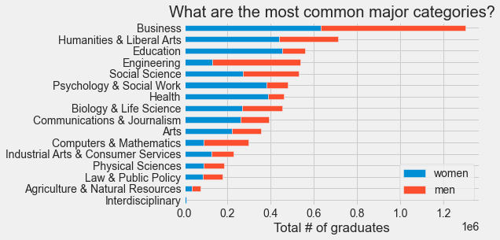
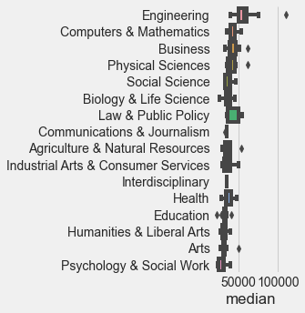
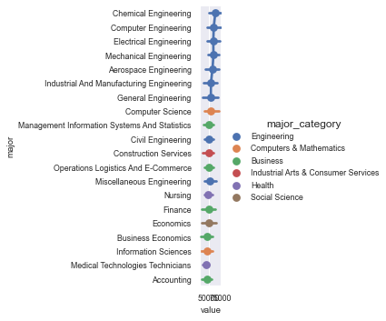

# Set up 


```python
import pandas as pd
from matplotlib import pyplot as plt
from janitor import clean_names
import numpy as np
import seaborn as sns
plt.style.use('fivethirtyeight')
```


```python
recent_grad = pd.read_csv(
    "https://raw.githubusercontent.com/rfordatascience/tidytuesday/master/data/2018/2018-10-16/recent-grads.csv")

recent_grad = clean_names(recent_grad)
recent_grad['major'] = recent_grad['major'].str.title()
```


```python
recent_grad.head()
```


<div>
<style scoped>
    .dataframe tbody tr th:only-of-type {
        vertical-align: middle;
    }

    .dataframe tbody tr th {
        vertical-align: top;
    }

    .dataframe thead th {
        text-align: right;
    }
</style>
<table border="1" class="dataframe">
  <thead>
    <tr style="text-align: right;">
      <th></th>
      <th>rank</th>
      <th>major_code</th>
      <th>major</th>
      <th>total</th>
      <th>men</th>
      <th>women</th>
      <th>major_category</th>
      <th>sharewomen</th>
      <th>sample_size</th>
      <th>employed</th>
      <th>...</th>
      <th>part_time</th>
      <th>full_time_year_round</th>
      <th>unemployed</th>
      <th>unemployment_rate</th>
      <th>median</th>
      <th>p25th</th>
      <th>p75th</th>
      <th>college_jobs</th>
      <th>non_college_jobs</th>
      <th>low_wage_jobs</th>
    </tr>
  </thead>
  <tbody>
    <tr>
      <th>0</th>
      <td>1</td>
      <td>2419</td>
      <td>Petroleum Engineering</td>
      <td>2339.0</td>
      <td>2057.0</td>
      <td>282.0</td>
      <td>Engineering</td>
      <td>0.120564</td>
      <td>36</td>
      <td>1976</td>
      <td>...</td>
      <td>270</td>
      <td>1207</td>
      <td>37</td>
      <td>0.018381</td>
      <td>110000</td>
      <td>95000</td>
      <td>125000</td>
      <td>1534</td>
      <td>364</td>
      <td>193</td>
    </tr>
    <tr>
      <th>1</th>
      <td>2</td>
      <td>2416</td>
      <td>Mining And Mineral Engineering</td>
      <td>756.0</td>
      <td>679.0</td>
      <td>77.0</td>
      <td>Engineering</td>
      <td>0.101852</td>
      <td>7</td>
      <td>640</td>
      <td>...</td>
      <td>170</td>
      <td>388</td>
      <td>85</td>
      <td>0.117241</td>
      <td>75000</td>
      <td>55000</td>
      <td>90000</td>
      <td>350</td>
      <td>257</td>
      <td>50</td>
    </tr>
    <tr>
      <th>2</th>
      <td>3</td>
      <td>2415</td>
      <td>Metallurgical Engineering</td>
      <td>856.0</td>
      <td>725.0</td>
      <td>131.0</td>
      <td>Engineering</td>
      <td>0.153037</td>
      <td>3</td>
      <td>648</td>
      <td>...</td>
      <td>133</td>
      <td>340</td>
      <td>16</td>
      <td>0.024096</td>
      <td>73000</td>
      <td>50000</td>
      <td>105000</td>
      <td>456</td>
      <td>176</td>
      <td>0</td>
    </tr>
    <tr>
      <th>3</th>
      <td>4</td>
      <td>2417</td>
      <td>Naval Architecture And Marine Engineering</td>
      <td>1258.0</td>
      <td>1123.0</td>
      <td>135.0</td>
      <td>Engineering</td>
      <td>0.107313</td>
      <td>16</td>
      <td>758</td>
      <td>...</td>
      <td>150</td>
      <td>692</td>
      <td>40</td>
      <td>0.050125</td>
      <td>70000</td>
      <td>43000</td>
      <td>80000</td>
      <td>529</td>
      <td>102</td>
      <td>0</td>
    </tr>
    <tr>
      <th>4</th>
      <td>5</td>
      <td>2405</td>
      <td>Chemical Engineering</td>
      <td>32260.0</td>
      <td>21239.0</td>
      <td>11021.0</td>
      <td>Engineering</td>
      <td>0.341631</td>
      <td>289</td>
      <td>25694</td>
      <td>...</td>
      <td>5180</td>
      <td>16697</td>
      <td>1672</td>
      <td>0.061098</td>
      <td>65000</td>
      <td>50000</td>
      <td>75000</td>
      <td>18314</td>
      <td>4440</td>
      <td>972</td>
    </tr>
  </tbody>
</table>
<p>5 rows × 21 columns</p>
</div>


# Exploratory Data Analysis


```python
by_major_category = ((recent_grad
    .assign(median_weighted=recent_grad['median'] * recent_grad['sample_size'])
    .groupby(['major_category']).agg({
    'total': 'sum',
    'women': 'sum',
    'men': 'sum',
    'median_weighted': 'sum',
    'sample_size': 'sum'}).assign(
    share_women=lambda x: x.women / x.total,
    median_salary=lambda x: x.median_weighted / x.sample_size))
                     .sort_values(by='share_women', ascending=False)).reset_index()
```


```python
by_major_category\
    .sort_values(by='total')[['major_category', 'women', 'men']]\
    .plot.barh(x='major_category', stacked=True)
plt.title("What are the most common major categories?")
plt.xlabel("Total # of graduates")
plt.ylabel("")
plt.show()
```





## What majors are earning the most? 


```python
(recent_grad.assign(
    major_median = recent_grad
    .groupby('major_category')['median']
    .transform('median'))
    .sort_values(by='major_median', ascending=False)
    .pipe((sns.catplot, 'data'),
         x='median',
         y='major_category',
         kind='box'))
plt.ylabel("")
```


    Text(-192.88, 0.5, '')





```python
grad_processing = recent_grad.sort_values(
    by='median', ascending=False)[['major', 'major_code', 'major_category', 'sample_size', 'p25th', 'median','p75th']]

grad_processing.info()
```

    <class 'pandas.core.frame.DataFrame'>
    Int64Index: 173 entries, 0 to 172
    Data columns (total 7 columns):
     #   Column          Non-Null Count  Dtype 
    ---  ------          --------------  ----- 
     0   major           173 non-null    object
     1   major_code      173 non-null    object
     2   major_category  173 non-null    object
     3   sample_size     173 non-null    int64 
     4   p25th           173 non-null    int64 
     5   median          173 non-null    int64 
     6   p75th           173 non-null    int64 
    dtypes: int64(4), object(3)
    memory usage: 10.8+ KB


```python
sns.set(font_scale=0.8)
plt.figure(figsize=(18,9))
g = (grad_processing[grad_processing['sample_size'] >= 100]
 .head(20)
 .melt(id_vars=['major', 'major_code', 'major_category', 'sample_size'])
 .pipe((sns.catplot, 'data'),
       x='value',
       y='major',
       hue='major_category',
       kind = 'point'))

```


    <Figure size 1296x648 with 0 Axes>





```python

```
