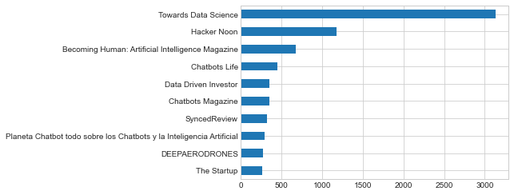
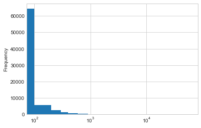
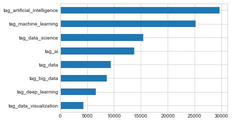
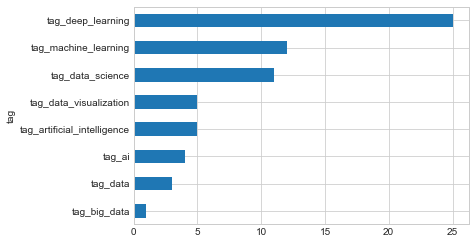
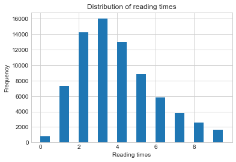
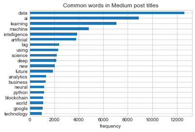

```{r setup, include=FALSE}
knitr::opts_chunk$set(echo = TRUE)
```


```python
import pandas as pd
import numpy as np
import matplotlib.pyplot as plt 
import nltk
plt.style.use("seaborn-whitegrid")
```

# Loading data 


```python
medium_datasci = pd.read_csv("https://raw.githubusercontent.com/rfordatascience/tidytuesday/master/data/2018/2018-12-04/medium_datasci.csv")\
.drop('x1', axis=1) # remove verticle, column x1

medium_datasci['title'] = medium_datasci['title'].str.lower()
```

# Cleaning & EDA


```python
medium_datasci.head()
```


<div>
<style scoped>
    .dataframe tbody tr th:only-of-type {
        vertical-align: middle;
    }

    .dataframe tbody tr th {
        vertical-align: top;
    }

    .dataframe thead th {
        text-align: right;
    }
</style>
<table border="1" class="dataframe">
  <thead>
    <tr style="text-align: right;">
      <th></th>
      <th>title</th>
      <th>subtitle</th>
      <th>image</th>
      <th>author</th>
      <th>publication</th>
      <th>year</th>
      <th>month</th>
      <th>day</th>
      <th>reading_time</th>
      <th>claps</th>
      <th>url</th>
      <th>author_url</th>
      <th>tag_ai</th>
      <th>tag_artificial_intelligence</th>
      <th>tag_big_data</th>
      <th>tag_data</th>
      <th>tag_data_science</th>
      <th>tag_data_visualization</th>
      <th>tag_deep_learning</th>
      <th>tag_machine_learning</th>
    </tr>
  </thead>
  <tbody>
    <tr>
      <th>0</th>
      <td>online animation: mixamo vs norah ai</td>
      <td>Online animations tools provide game designers...</td>
      <td>1</td>
      <td>Emma Laurent</td>
      <td>NaN</td>
      <td>2017</td>
      <td>8</td>
      <td>1</td>
      <td>5</td>
      <td>12.0</td>
      <td>https://medium.com/@laurentemma/online-animati...</td>
      <td>https://medium.com/@laurentemma</td>
      <td>1</td>
      <td>0</td>
      <td>0</td>
      <td>0</td>
      <td>0</td>
      <td>0</td>
      <td>0</td>
      <td>0</td>
    </tr>
    <tr>
      <th>1</th>
      <td>a.i. ?</td>
      <td>NaN</td>
      <td>0</td>
      <td>Sanparith Marukatat</td>
      <td>NaN</td>
      <td>2017</td>
      <td>8</td>
      <td>1</td>
      <td>2</td>
      <td>11.0</td>
      <td>https://medium.com/@sanparithmarukatat/a-i-%E0...</td>
      <td>https://medium.com/@sanparithmarukatat</td>
      <td>1</td>
      <td>0</td>
      <td>0</td>
      <td>0</td>
      <td>0</td>
      <td>0</td>
      <td>0</td>
      <td>0</td>
    </tr>
    <tr>
      <th>2</th>
      <td>futures of ai, friendly ai?</td>
      <td>From Physics of the Future: How Science Will S...</td>
      <td>1</td>
      <td>Z</td>
      <td>NaN</td>
      <td>2017</td>
      <td>8</td>
      <td>1</td>
      <td>3</td>
      <td>1.0</td>
      <td>https://medium.com/@otherside914/futures-of-ai...</td>
      <td>https://medium.com/@otherside914</td>
      <td>1</td>
      <td>0</td>
      <td>0</td>
      <td>0</td>
      <td>0</td>
      <td>0</td>
      <td>0</td>
      <td>0</td>
    </tr>
    <tr>
      <th>3</th>
      <td>the value generated through ai led mindfulness</td>
      <td>A true product co-created by the Millennials</td>
      <td>1</td>
      <td>Emiko Sawaguchi</td>
      <td>MILLENNIALSTIMES</td>
      <td>2017</td>
      <td>8</td>
      <td>1</td>
      <td>5</td>
      <td>4.0</td>
      <td>https://millennials-times.com/creativeflower-e...</td>
      <td>https://millennials-times.com/@emikosawaguchi</td>
      <td>1</td>
      <td>0</td>
      <td>0</td>
      <td>0</td>
      <td>0</td>
      <td>0</td>
      <td>0</td>
      <td>0</td>
    </tr>
    <tr>
      <th>4</th>
      <td>os melhores links de julhocmeras vintage, goog...</td>
      <td>mas pera a?</td>
      <td>1</td>
      <td>Giovani Ferreira</td>
      <td>NEW ORDER</td>
      <td>2017</td>
      <td>8</td>
      <td>1</td>
      <td>3</td>
      <td>56.0</td>
      <td>https://medium.com/neworder/os-melhores-links-...</td>
      <td>https://medium.com/@gferreira</td>
      <td>1</td>
      <td>0</td>
      <td>0</td>
      <td>0</td>
      <td>0</td>
      <td>0</td>
      <td>0</td>
      <td>0</td>
    </tr>
  </tbody>
</table>
</div>


Let's try to get a feel with this data. Start with the distribution of the features in interest

## Which publication is the the most popular one? 


```python
medium_datasci['publication'].value_counts().head(10).sort_values().plot(kind = "barh")
```


    <AxesSubplot:>





# Who has the most posts?


```python
medium_datasci['author'].value_counts().head(10)
```


    Yves Mulkers            487
    Synced                  328
    DEEP AERO DRONES        279
    AI Hawk                 245
    Peter Marshall          209
    Ilexa Yardley           162
    Alibaba Cloud           160
    Corsair's Publishing    156
    Jae Duk Seo             150
    C Gavilanes             142
    Name: author, dtype: int64


## What is the distribution of claps? 


```python
bins = np.arange(medium_datasci['claps'].min(), medium_datasci['claps'].max(), 100)
medium_datasci['claps'].plot(kind="hist", logx=True, bins=bins)
```


    <AxesSubplot:ylabel='Frequency'>





## What is the tag about?


```python
medium_datasci.filter(like="tag").head() # select columns contain tag
```


<div>
<style scoped>
    .dataframe tbody tr th:only-of-type {
        vertical-align: middle;
    }

    .dataframe tbody tr th {
        vertical-align: top;
    }

    .dataframe thead th {
        text-align: right;
    }
</style>
<table border="1" class="dataframe">
  <thead>
    <tr style="text-align: right;">
      <th></th>
      <th>tag_ai</th>
      <th>tag_artificial_intelligence</th>
      <th>tag_big_data</th>
      <th>tag_data</th>
      <th>tag_data_science</th>
      <th>tag_data_visualization</th>
      <th>tag_deep_learning</th>
      <th>tag_machine_learning</th>
    </tr>
  </thead>
  <tbody>
    <tr>
      <th>0</th>
      <td>1</td>
      <td>0</td>
      <td>0</td>
      <td>0</td>
      <td>0</td>
      <td>0</td>
      <td>0</td>
      <td>0</td>
    </tr>
    <tr>
      <th>1</th>
      <td>1</td>
      <td>0</td>
      <td>0</td>
      <td>0</td>
      <td>0</td>
      <td>0</td>
      <td>0</td>
      <td>0</td>
    </tr>
    <tr>
      <th>2</th>
      <td>1</td>
      <td>0</td>
      <td>0</td>
      <td>0</td>
      <td>0</td>
      <td>0</td>
      <td>0</td>
      <td>0</td>
    </tr>
    <tr>
      <th>3</th>
      <td>1</td>
      <td>0</td>
      <td>0</td>
      <td>0</td>
      <td>0</td>
      <td>0</td>
      <td>0</td>
      <td>0</td>
    </tr>
    <tr>
      <th>4</th>
      <td>1</td>
      <td>0</td>
      <td>0</td>
      <td>0</td>
      <td>0</td>
      <td>0</td>
      <td>0</td>
      <td>0</td>
    </tr>
  </tbody>
</table>
</div>


### Which tag is the most popular?


```python
medium_datasci.filter(like="tag").sum().sort_values().plot(kind='barh')
```


    <AxesSubplot:>





## Tranformation


```python
medium_melt = medium_datasci.melt(
    id_vars=medium_datasci.drop(medium_datasci.filter(like="tag").columns.to_list(), axis=1),
    var_name= "tag").\
    query("value == 1")

medium_melt.head()
```


<div>
<style scoped>
    .dataframe tbody tr th:only-of-type {
        vertical-align: middle;
    }

    .dataframe tbody tr th {
        vertical-align: top;
    }

    .dataframe thead th {
        text-align: right;
    }
</style>
<table border="1" class="dataframe">
  <thead>
    <tr style="text-align: right;">
      <th></th>
      <th>title</th>
      <th>subtitle</th>
      <th>image</th>
      <th>author</th>
      <th>publication</th>
      <th>year</th>
      <th>month</th>
      <th>day</th>
      <th>reading_time</th>
      <th>claps</th>
      <th>url</th>
      <th>author_url</th>
      <th>tag</th>
      <th>value</th>
    </tr>
  </thead>
  <tbody>
    <tr>
      <th>0</th>
      <td>online animation: mixamo vs norah ai</td>
      <td>Online animations tools provide game designers...</td>
      <td>1</td>
      <td>Emma Laurent</td>
      <td>NaN</td>
      <td>2017</td>
      <td>8</td>
      <td>1</td>
      <td>5</td>
      <td>12.0</td>
      <td>https://medium.com/@laurentemma/online-animati...</td>
      <td>https://medium.com/@laurentemma</td>
      <td>tag_ai</td>
      <td>1</td>
    </tr>
    <tr>
      <th>1</th>
      <td>a.i. ?</td>
      <td>NaN</td>
      <td>0</td>
      <td>Sanparith Marukatat</td>
      <td>NaN</td>
      <td>2017</td>
      <td>8</td>
      <td>1</td>
      <td>2</td>
      <td>11.0</td>
      <td>https://medium.com/@sanparithmarukatat/a-i-%E0...</td>
      <td>https://medium.com/@sanparithmarukatat</td>
      <td>tag_ai</td>
      <td>1</td>
    </tr>
    <tr>
      <th>2</th>
      <td>futures of ai, friendly ai?</td>
      <td>From Physics of the Future: How Science Will S...</td>
      <td>1</td>
      <td>Z</td>
      <td>NaN</td>
      <td>2017</td>
      <td>8</td>
      <td>1</td>
      <td>3</td>
      <td>1.0</td>
      <td>https://medium.com/@otherside914/futures-of-ai...</td>
      <td>https://medium.com/@otherside914</td>
      <td>tag_ai</td>
      <td>1</td>
    </tr>
    <tr>
      <th>3</th>
      <td>the value generated through ai led mindfulness</td>
      <td>A true product co-created by the Millennials</td>
      <td>1</td>
      <td>Emiko Sawaguchi</td>
      <td>MILLENNIALSTIMES</td>
      <td>2017</td>
      <td>8</td>
      <td>1</td>
      <td>5</td>
      <td>4.0</td>
      <td>https://millennials-times.com/creativeflower-e...</td>
      <td>https://millennials-times.com/@emikosawaguchi</td>
      <td>tag_ai</td>
      <td>1</td>
    </tr>
    <tr>
      <th>4</th>
      <td>os melhores links de julhocmeras vintage, goog...</td>
      <td>mas pera a?</td>
      <td>1</td>
      <td>Giovani Ferreira</td>
      <td>NEW ORDER</td>
      <td>2017</td>
      <td>8</td>
      <td>1</td>
      <td>3</td>
      <td>56.0</td>
      <td>https://medium.com/neworder/os-melhores-links-...</td>
      <td>https://medium.com/@gferreira</td>
      <td>tag_ai</td>
      <td>1</td>
    </tr>
  </tbody>
</table>
</div>


```python
medium_melt['tag'].value_counts()
```


    tag_artificial_intelligence    29580
    tag_machine_learning           25175
    tag_data_science               15424
    tag_ai                         13763
    tag_data                        9420
    tag_big_data                    8686
    tag_deep_learning               6612
    tag_data_visualization          4334
    Name: tag, dtype: int64


### Which tag has the most claps?


```python
medium_melt.groupby('tag')['claps'].median().sort_values().plot(kind="barh")
```


    <AxesSubplot:ylabel='tag'>





### How about the reading times?


```python
# Ifelse
reading_time_simplified = np.where(medium_datasci['reading_time'] < 10, medium_datasci['reading_time'], 10)
# Create bins
bins = np.arange(reading_time_simplified.min(), reading_time_simplified.max(), .5)
# Plot
pd.Series(np.where(medium_datasci['reading_time'] < 10, medium_datasci['reading_time'], 10)).plot(kind="hist", bins=bins)
plt.title("Distribution of reading times")
plt.xlabel("Reading times")
```


    Text(0.5, 0, 'Reading times')





# Text Mining


```python
import spacy
import en_core_web_sm
nlp = en_core_web_sm.load()
```


```python
# example of using SpaCy to tokenize a simple string

def tokenize(sent):
    doc = nlp.tokenizer(sent)
    return [token.text for token in doc]
```


```python
words_tokenize = medium_datasci['title'].astype(str).apply(tokenize).apply(pd.Series)
unnest_words_tokenize = words_tokenize.stack().reset_index(level=0).rename(columns={"level_0":"post_id", 0:"word"})
```


```python
stop_words = pd.DataFrame(nltk.corpus.stopwords.words('english')).rename(columns={0:"word"})
medium_words_pre = pd.merge(medium_datasci.reset_index().rename(columns={"index":"post_id"}), unnest_words_tokenize)
medium_words = pd.merge(medium_words_pre, stop_words, how='left', indicator=True)
```


```python
medium_words = medium_words[medium_words['_merge'] == "left_only"].drop('_merge', axis = 1)
```


```python
medium_words = medium_words[(medium_words['word'].str.contains('[a-zA-Z]')) & (~medium_words['word'].isin(['nan', 'part', 'de']))]
```


```python
medium_words['word'].value_counts().head(20).sort_values().plot(kind='barh')
plt.title("Common words in Medium post titles")
plt.xlabel("frequency")
```


    Text(0.5, 0, 'frequency')





*To be continued..*
