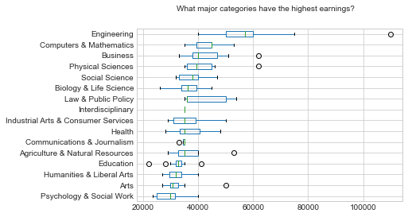
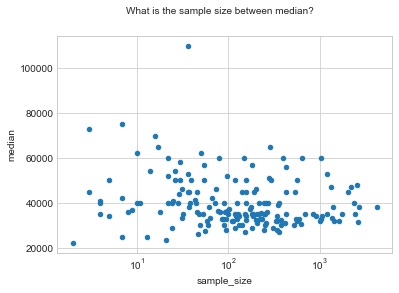

# Loading the packages


```python
# set up
import pandas as pd
from matplotlib import pyplot as plt
from janitor import clean_names
import numpy as np
plt.style.use('seaborn-whitegrid')
```

# Loading data


```python
# EDA
# set up
tt_path = "https://raw.githubusercontent.com/rfordatascience/tidytuesday/master/data/2018/2018-10-16/recent-grads.csv"
recent_grad = pd.read_csv(tt_path)

recent_grad = clean_names(recent_grad) # snake case columns
recent_grad['major'] = recent_grad['major'].str.title() # str to title
recent_grad.head()
```


<div>
<style scoped>
    .dataframe tbody tr th:only-of-type {
        vertical-align: middle;
    }

    .dataframe tbody tr th {
        vertical-align: top;
    }

    .dataframe thead th {
        text-align: right;
    }
</style>
<table border="1" class="dataframe">
  <thead>
    <tr style="text-align: right;">
      <th></th>
      <th>rank</th>
      <th>major_code</th>
      <th>major</th>
      <th>total</th>
      <th>men</th>
      <th>women</th>
      <th>major_category</th>
      <th>sharewomen</th>
      <th>sample_size</th>
      <th>employed</th>
      <th>...</th>
      <th>part_time</th>
      <th>full_time_year_round</th>
      <th>unemployed</th>
      <th>unemployment_rate</th>
      <th>median</th>
      <th>p25th</th>
      <th>p75th</th>
      <th>college_jobs</th>
      <th>non_college_jobs</th>
      <th>low_wage_jobs</th>
    </tr>
  </thead>
  <tbody>
    <tr>
      <th>0</th>
      <td>1</td>
      <td>2419</td>
      <td>Petroleum Engineering</td>
      <td>2339.0</td>
      <td>2057.0</td>
      <td>282.0</td>
      <td>Engineering</td>
      <td>0.120564</td>
      <td>36</td>
      <td>1976</td>
      <td>...</td>
      <td>270</td>
      <td>1207</td>
      <td>37</td>
      <td>0.018381</td>
      <td>110000</td>
      <td>95000</td>
      <td>125000</td>
      <td>1534</td>
      <td>364</td>
      <td>193</td>
    </tr>
    <tr>
      <th>1</th>
      <td>2</td>
      <td>2416</td>
      <td>Mining And Mineral Engineering</td>
      <td>756.0</td>
      <td>679.0</td>
      <td>77.0</td>
      <td>Engineering</td>
      <td>0.101852</td>
      <td>7</td>
      <td>640</td>
      <td>...</td>
      <td>170</td>
      <td>388</td>
      <td>85</td>
      <td>0.117241</td>
      <td>75000</td>
      <td>55000</td>
      <td>90000</td>
      <td>350</td>
      <td>257</td>
      <td>50</td>
    </tr>
    <tr>
      <th>2</th>
      <td>3</td>
      <td>2415</td>
      <td>Metallurgical Engineering</td>
      <td>856.0</td>
      <td>725.0</td>
      <td>131.0</td>
      <td>Engineering</td>
      <td>0.153037</td>
      <td>3</td>
      <td>648</td>
      <td>...</td>
      <td>133</td>
      <td>340</td>
      <td>16</td>
      <td>0.024096</td>
      <td>73000</td>
      <td>50000</td>
      <td>105000</td>
      <td>456</td>
      <td>176</td>
      <td>0</td>
    </tr>
    <tr>
      <th>3</th>
      <td>4</td>
      <td>2417</td>
      <td>Naval Architecture And Marine Engineering</td>
      <td>1258.0</td>
      <td>1123.0</td>
      <td>135.0</td>
      <td>Engineering</td>
      <td>0.107313</td>
      <td>16</td>
      <td>758</td>
      <td>...</td>
      <td>150</td>
      <td>692</td>
      <td>40</td>
      <td>0.050125</td>
      <td>70000</td>
      <td>43000</td>
      <td>80000</td>
      <td>529</td>
      <td>102</td>
      <td>0</td>
    </tr>
    <tr>
      <th>4</th>
      <td>5</td>
      <td>2405</td>
      <td>Chemical Engineering</td>
      <td>32260.0</td>
      <td>21239.0</td>
      <td>11021.0</td>
      <td>Engineering</td>
      <td>0.341631</td>
      <td>289</td>
      <td>25694</td>
      <td>...</td>
      <td>5180</td>
      <td>16697</td>
      <td>1672</td>
      <td>0.061098</td>
      <td>65000</td>
      <td>50000</td>
      <td>75000</td>
      <td>18314</td>
      <td>4440</td>
      <td>972</td>
    </tr>
  </tbody>
</table>
<p>5 rows × 21 columns</p>
</div>


# Exploratory Data Analysis

## What is the most popular major category?


```python
by_major_category = recent_grad \
    .assign(median_weighted = recent_grad['median'] * recent_grad['sample_size'])\
    .groupby('major_category')['total', 'women', 'men', 'median_weighted', 'sample_size'].sum()\
    .assign(share_women = lambda x: x['women']/x['total'],
            median_weight = lambda x: x['median_weighted']/x['total'])

p1 = by_major_category.sort_values(by='total')[['women', 'men']].plot(kind="barh", stacked=True)
p1.set_xticks(np.arange(0, 1000000, 500000))
plt.xlabel("")
plt.suptitle("What is the most popular major category", fontsize=10)
plt.title("Contribution by gender", fontsize=16)
plt.show()
```

    /Users/whisky/miniconda3/lib/python3.7/site-packages/ipykernel_launcher.py:3: FutureWarning: Indexing with multiple keys (implicitly converted to a tuple of keys) will be deprecated, use a list instead.
      This is separate from the ipykernel package so we can avoid doing imports until


## What major category earns the most?


```python
# what major categories have the highest earnings ?
recent_grad_pivot = recent_grad[["major_category", "median"]]\
    .pivot(columns="major_category", values="median")

recent_grad_pivot.reindex(recent_grad_pivot.median().sort_values().index, axis=1)\
    .plot(kind="box", vert=False)
plt.suptitle("What major categories have the highest earnings?", fontsize=10)
plt.show()
```





## Sample size


```python
recent_grad.plot(x="sample_size", y="median", kind="scatter", logx=True)
plt.suptitle("What is the sample size between median?", fontsize=10)
plt.show()

```




